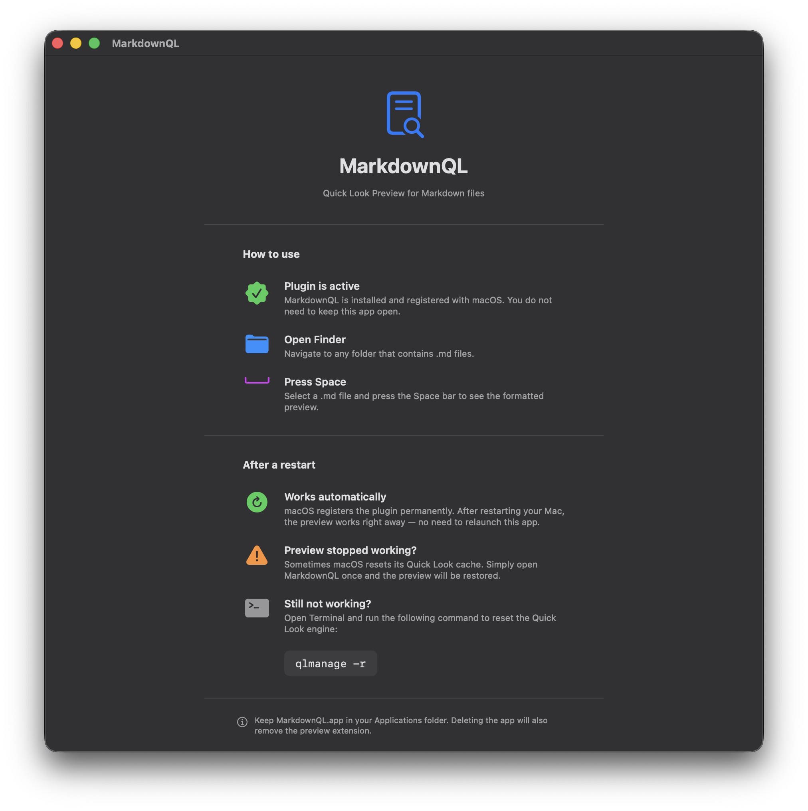

# MarkdownQL

**Quick Look Plugin for macOS** – renders `.md` Markdown files directly in Finder Preview.

Just select any `.md` file in Finder and press **Space**.



## Features

- Headings H1–H6
- **Bold**, *Italic*, ~~Strikethrough~~
- `Inline code` and fenced code blocks
- Blockquotes
- Unordered and ordered lists
- Links
- Horizontal rules
- Dark Mode support (automatic)

## Installation

### Option 1 – Direct Download (recommended)

1. Download the latest release from [Releases](../../releases) (`MarkdownQL.zip`)
2. Unzip and drag `MarkdownQL.app` into your **Applications** folder
3. **Launch the app once** (Right-click → Open → Open Anyway)
4. The app can stay in the background or be closed afterwards

That's it – `.md` files will now show a formatted preview in Finder when you press Space.

> **Note:** On first launch macOS will show a security warning because the app is not from the App Store. Right-click → Open → "Open Anyway" is only needed once.

### Option 2 – Build from Source (Xcode)

```bash
git clone https://github.com/DEIN-USERNAME/MarkdownQL.git
cd MarkdownQL
open MarkdownQL.xcodeproj
```

In Xcode: **⌘ + R** → Finder launches → select a `.md` file and press Space

## Requirements

- macOS 12 Monterey or later
- No external dependencies

## Uninstall

Delete `MarkdownQL.app` from your Applications folder – the extension is removed automatically.

## License

MIT License – free to use and modify.
