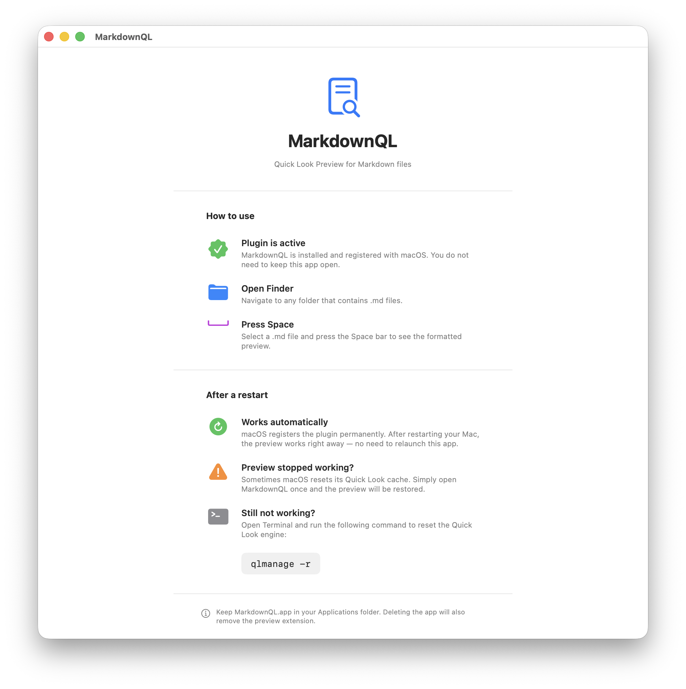

# MarkdownQL

**Quick Look Plugin für macOS** – zeigt `.md` Markdown-Dateien im Finder formatiert an.

Einfach eine `.md`-Datei im Finder auswählen und **Leertaste** drücken.



## Features

- Überschriften H1–H6
- **Fett**, *Kursiv*, ~~Durchgestrichen~~
- `Inline-Code` und Code-Blöcke
- Blockquotes
- Ungeordnete und geordnete Listen
- Links
- Horizontale Trennlinien
- Dark Mode automatisch

## Installation

### Option 1 – Direktdownload (empfohlen)

1. Neueste Version unter [Releases](../../releases) herunterladen (`MarkdownQL.zip`)
2. ZIP entpacken → `MarkdownQL.app` in den Ordner **Programme** ziehen
3. App **einmal starten** (Rechtsklick → Öffnen → Trotzdem öffnen)
4. App kann danach im Hintergrund bleiben oder beendet werden

Das war's – ab sofort werden `.md`-Dateien im Finder mit Leertaste formatiert angezeigt.

> **Hinweis:** Beim ersten Start erscheint eine macOS-Sicherheitswarnung, weil die App nicht im App Store ist. Rechtsklick → Öffnen → "Trotzdem öffnen" reicht einmalig aus.

### Option 2 – Selbst bauen (Xcode)

```bash
git clone https://github.com/DEIN-USERNAME/MarkdownQL.git
cd MarkdownQL
open MarkdownQL/MarkdownQL.xcodeproj
```

In Xcode: **⌘ + R** → Finder starten → `.md`-Datei + Leertaste

## Systemvoraussetzungen

- macOS 12 (Monterey) oder neuer
- Keine weiteren Abhängigkeiten

## Deinstallation

`MarkdownQL.app` aus dem Programme-Ordner löschen – die Extension wird automatisch entfernt.

## Lizenz

MIT License – frei verwendbar und veränderbar.
